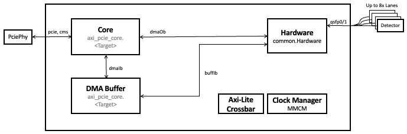

pgp-pcie-apps Documentation
============================

`DOE Code <https://www.osti.gov/doecode/biblio/75501>`_

Firmware and software for moving data between PGP-protocol optical links
(typically connected to detectors) and a PCIe DMA engine.  Virtual
channels and higher-level routing are owned by the software stack; this
repo provides the PGP↔DMA/AXI-PCIe plumbing and the board-specific
target designs that build into ``.bit`` and ``.mcs`` artefacts.

The repository is hardware-agnostic and supports multiple Xilinx
carrier boards via the :repo:`firmware/targets/` tree.

Features
--------

* Protocol-lane handlers for PGP2b / PGP3 / PGP4 and HTSP 100G, built on
  ``surf``.
* AXI-PCIe DMA integration via ``axi-pcie-core`` — see the
  `axi-pcie-core documentation <https://slaclab.github.io/axi-pcie-core/>`_.
* PyRogue-based scripts under :repo:`software/scripts/` for register
  access, monitoring, PRBS testing, and on-the-fly FPGA reprogramming.

Getting Started
---------------

* **First build** — :doc:`tutorial/first_build` walks through cloning
  the repo, sourcing Vivado, and building
  ``XilinxVariumC1100DmaLoopback`` end to end.
* **Load the PCIe driver** — :doc:`how-to/load_driver` covers the
  ``aes-stream-drivers`` ``datadev.ko`` build and load procedure.
* **Reprogram an installed card** — :doc:`how-to/program_with_updatepciefpga`
  covers ``updatePcieFpga.py``.

.. toctree::
   :maxdepth: 2
   :caption: Contents:

   tutorial/index
   how-to/index
   reference/index
   explanation/index
